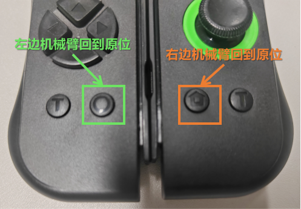

# 2只机械臂 + 2只手柄的配置说明（双臂操作）
<p align="center">
  <a href="Double_tutorial_en.md">English</a> •
  <a href="Double_tutorial.md">中文</a> 
</p>

&nbsp;

## (一) 设备号绑定

### 1.设备号固定为自定义端口（Box推荐）

不推荐[原版的端口设置方法](./bugs_Q&A.md#L1)。**原因**：写入设备rules做映射，保证每次机械臂顺序插的不一样也可以读取到正确的端口ID，避免左右臂插的顺序错误导致校准文件读取错误，错误运行损坏机械臂。配置步骤如下：

(1) 插入右边的机械臂，这里``只能插入一根机械臂``到USB口，输入以下指令：
  
```shell
udevadm info -a -n /dev/ttyACM* | grep serial
```

```shell
# 将输出类似ID号：
#     ATTRS{serial}=="58FA083324"
#     ATTRS{serial}=="0000:00:14.0"
```

(2) 将输出的上面的编码值``ATTRS{serial}``输入到 [lerobot/configs/robot/rules/99-lerobot-serial.rules](lerobot/configs/robot/rules/99-lerobot-serial.rules) 的第1行``ATTRS{serial}``中代表着lerobot_right右臂或者主臂。
  
(3) ``拔掉``刚才的机械臂，``插上另一个``机械臂（期望是左边的，或者是从臂），查看ID

```shell
udevadm info -a -n /dev/ttyACM* | grep serial # 如果只有一支臂，只需要改第一行
```
(4) 将输出的ID输入到 [lerobot/configs/robot/rules/99-lerobot-serial.rules](lerobot/configs/robot/rules/99-lerobot-serial.rules) 的第2行``ATTRS{serial}``中代表着lerobot_left左臂或者从臂
  
(5) 运行下面的指令，将规则文件写入Ubuntu系统目录，此后将会自动识别左、右机械臂

```shell
sudo cp lerobot/configs/robot/rules/99-lerobot-serial.rules /etc/udev/rules.d/
sudo chmod +x /etc/udev/rules.d/99-lerobot-serial.rules
sudo udevadm control --reload-rules && sudo udevadm trigger
# 如果中间设计输入密码，请重新运行。(正常运行鼠标会卡一下)
```

&nbsp;

## (二) 校准机械臂

### 1. 校准指令

 (1) 这里``请插入全部的机械臂``，如果按照上述顺序配置，对应关系如下，摆到对应位置之后，再命令终端``敲击回车``，进入下一个姿态矫正，各个姿态如下图所示。
- ``左臂`` == lerobot_left ==> 校准时会提示校准 ``main follower`` 
- ``右臂`` == lerobot_right ==> 校准时会提示校准 ``main leader`` 

一般会从Follower开始，即``左边机械臂开始``，然后是右边机械臂。(注意每次校准会删除之前的校准文件，如果提前终止或者报错结束，将不存在校准文件。)

```shell
# 如果是双臂校准
python lerobot/scripts/control_robot.py calibrate \
    --robot-path lerobot/configs/robot/so100.yaml \
    --robot-overrides '~cameras'
```

| 1. Follower Zero position | 2. Follower Rotated position | 3. Follower Rest position |
|---|---|---|
|  |  |  |

**注意``2 Rortated position``，整个机械臂姿态方向一定要观察清楚，并且转动每个关节的时候不要太快，太快容易烧坏电机。**

- 如遇“failed due to communication error”报错，请查看[bugs_Q&A.md#L27](bugs_Q&A.md#L27)

&nbsp;

## (三) 记录数据集【主从模式采集测试】

### 1. 无相机观察的遥操作测试（右臂遥控左臂）

```shell
python lerobot/scripts/control_robot.py teleoperate \
    --robot-path lerobot/configs/robot/so100.yaml \
    --robot-overrides '~cameras' \
    --display-cameras 0
```

- 如遇“No integer found”报错，请参考[bugs_Q&A.md#L38](bugs_Q&A.md#L38)

### 3. 进行带相机图像的可视化遥操

```shell
python lerobot/scripts/control_robot.py teleoperate \
    --robot-path lerobot/configs/robot/so100.yaml 
```

程序卡死/无任何反应[bugs_Q&A.md#L53](bugs_Q&A.md#L53)

找不到摄像头报错请查看[bugs_Q&A.md#L66](bugs_Q&A.md#L66)


### 4. 录制数据集

```shell
python lerobot/scripts/control_robot.py record \
    --robot-path lerobot/configs/robot/so100.yaml \
    --fps 30 \
    --tags so100 tutorial \
    --warmup-time-s 5 \
    --episode-time-s 40 \
    --reset-time-s 5 \
    --num-episodes 10 \
    --push-to-hub 0 \
    --local-files-only 1 \
    --root datasets/so100_test \
    --repo-id task/so100_test \
    --single-task so100_test \
    --resume 1 
```

(1) 重要参数说明：

  - ``robot-path``：对应的机器人参数配置文件
  - ``root``:保存路径
  - ``reset-time-s``:录制时长
  - ``num-episodes``:本轮采集的轮数
  - ``fps``:相机帧数

(2) 使用说明：
  - 脚本启动轮动帧数，即开始录制
  - ``键盘右箭头 >``：完成当前任务，保存，并准备下一次任务数据集录制
  - ``键盘左箭头 <``：等待10秒后重新录制当前剧集(episode)
  - ``键盘ESC键``: 结束录制，请不摇按Ctrl+C结束，这样会使数据集破损（缺少mean and std）

### 5. 可视化数据集
可以查看录制的轨迹数据，包括图像和轨迹姿态

```shell
python lerobot/scripts/visualize_dataset.py \
    --root datasets/so100_test \
    --local-files-only 1 \
    --mode 0 \
    --repo-id task/so100_test \
    --episode-index 0 \
    --save 1 \
    --output-dir datasets/so100_test/visualize
    
rerun datasets/so100_test/visualize/task_so100_test_episode_0.rrd
```


### 6. 重播数据集

机械臂将重复曾经录制的一个轨迹（注意机械臂会按照之前的采集轨迹运动）

```shell
DATA_DIR=data python lerobot/scripts/control_robot.py replay \
    --robot-path lerobot/configs/robot/so100.yaml \
    --fps 30 \
    --root datasets/so100_test \
    --repo-id task/so100_test \
    --episode 0 \
    --local-files-only 1
```

&nbsp;

## (五) 本地训练和推理

由于Huggingface建议使用它们的云托管，所以本地训练模型需要一定的设置[本仓库已设置](bugs_Q&A.md#L98)

### 1. 开始本地训练

```shell
python lerobot/scripts/train.py \
  policy=act_so100_real \
  env=so100_real \
  device=cuda \
  wandb.enable=false \
  local_only.enable=true \
  dataset_repo_id=task/so100_test \
  hydra.run.dir=outputs/train/act_so100_test \
  hydra.job.name=act_so100_test \
  local_only.path=datasets/so100_test 
```
其中重点关注策略模型配置：[lerobot/configs/policy/act_so100_real.yaml:30](lerobot/configs/policy/act_so100_real.yaml:30)的训练步数``offline_steps``，保存频率``save_freq``

报错请查看[bugs_Q&A.md#L133](bugs_Q&A.md#L133)

### 2. 开始推理
推荐使用record函数中的tags为eval的模块进行推理，同时会自动记录推理的过程数据集，保存在以``eval_``开头的地址中。

```shell
python lerobot/scripts/control_robot.py record \
  --robot-path lerobot/configs/robot/so100.yaml \
  --fps 30 \
  --tags so100 tutorial eval \
  --warmup-time-s 5 \
  --episode-time-s 40 \
  --reset-time-s 5 \
  --num-episodes 10 \
  --local-files-only 1 \
  --repo-id task/eval_so100_test \
  --single-task eval_so100_test \
  --root datasets/eval_so100_test \
  -p outputs/train/act_so100_test/checkpoints/last/pretrained_model 
```
&nbsp;

## (六)JoyCon手柄遥操作

### 0. 环境配置

手柄遥操作需要用到Joycon-robotics安装手柄驱动和遥操策略，以及正逆运动学库lerobot-kinematics，进行姿态解算。

- [joycon-robotics](https://github.com/box2ai-robotics/joycon-robotics)

- [lerobot-kinematics](https://github.com/box2ai-robotics/lerobot-kinematics)

安装指令如下：

```shell
  # joycon-robotics
  conda activate lerobot
  git clone https://github.com/box2ai-robotics/joycon-robotics.git
  cd joycon-robotics
  
  pip install -e .
  sudo apt-get update
  sudo apt-get install -y dkms libevdev-dev libudev-dev cmake
  make install
  # 最好先去那边joycon-robotics/joyconrobotics_tutorial.ipynb测试一下手柄，通过之后在进行下一步

  # lerobot-kinematics
  conda activate lerobot
  git clone https://github.com/box2ai-robotics/lerobot-kinematics.git
  cd lerobot-kinematics
  pip install -e .
```

- network网络报错，请查看[bugs_Q&A.md#L1](bugs_Q&A.md#L1)

如果单纯想玩运动学控制，可以将[lerobot/.cache/calibration/so100/main_follower.json](lerobot/.cache/calibration/so100/main_follower.json)复制到``lerobot-kinematics/examples``目录下，并参考他的readme。

### 1. 蓝牙连接

 (1) 首次连接：``长按3秒遥控器侧边小圆按钮进行蓝牙配对``，在电脑中的蓝牙设备搜索中将出现“Joy-Con(R)”或者“Joy-Con(R)”点击匹配连接。
 
 (2) 连接成功之后，手柄将按照一定频率``震动``。如果单手柄运行，则同时按住两个扳机按钮3秒，如果是双手柄同时使用，则两只手柄都开始震动之后，同时按下左手柄的上扳机键（L）和有手柄的上扳机键（R）。此后，系统将分配固定的进程进行单手柄或双手柄的连接守护。

 
 
 
 (3) 若已连接配对成功之后，下一次连接相同的电脑只需要按下上扳机键，即可自动搜索快速匹配，5秒内机会出现一定频率的“确定震动”，按照上一步的操作即可连接成功。
 
### 2. 手柄遥操

#### (1) 重命名矫正参数文件

需要将上述机械臂校准的文件重命名一下: 

``main_leader.json`` 拷贝重命名为 ``right_follower.json``

``main_follower.json`` 拷贝重命名为 ``left_follower.json``;

可以执行下面的指令快速地重命名（在"."开头隐藏文件夹中，需要按"ctrl+H"开启显示）：

```shell
# 如果两只机械臂
cp .cache/calibration/so100/main_leader.json .cache/calibration/so100/right_follower.json
cp .cache/calibration/so100/main_follower.json .cache/calibration/so100/left_follower.json
```

#### (2) 单臂使用遥控器遥操作:

```shell
# remember 
cp .cache/calibration/so100/main_follower.json .cache/calibration/so100/right_follower.json

python lerobot/scripts/control_robot.py teleoperate \
    --robot-path lerobot/configs/robot/so100_joycon_single.yaml \
    --robot-overrides '~cameras' 
```

- 手柄连接bug，请参考[bugs_Q&A.md#L140](bugs_Q&A.md#L140)
- 如遇STL文件相关报错，请参考[bugs_Q&A.md#L129](bugs_Q&A.md#L129)
- 如遇GLX/OpenGL相关报错，请参考[bugs_Q&A.md#L43](bugs_Q&A.md#L43)
- 程序卡死/无任何反应[bugs_Q&A.md#L53](bugs_Q&A.md#L53)
- 找不到摄像头报错请查看[bugs_Q&A.md#L66](bugs_Q&A.md#L66)

#### (3) 双臂使用遥控器遥操作:

```shell
# remember
cp .cache/calibration/so100/main_leader.json .cache/calibration/so100/right_follower.json
cp .cache/calibration/so100/main_follower.json .cache/calibration/so100/left_follower.json

python lerobot/scripts/control_robot.py teleoperate \
    --robot-path lerobot/configs/robot/so100_joycon_double.yaml \
    --robot-overrides '~cameras' 
```

#### (4) 使用教程：
#### 坐标系说明
- 末端前方朝向：`X+` 方向
- 右边：`Y+` 方向
- 上方：`Z+` 方向

#### 摇杆控制（末端第一人称视角）
- 摇杆向上：朝末端指向的方向前进
- 摇杆向下：朝末端指向的方向后退
- 摇杆向左：朝末端指向的横向方向向左平移
- 摇杆向右：朝末端指向的横向方向向右平移

#### 按键功能
##### 基础功能
1. ​**复位**：
   - 右手 `Home` 键 或 左手 `O`（截图键）：回到初始位置


2. ​**夹爪控制**：
   - 右手 `ZR`（下扳机键）或 左手 `ZL`（下扳机键）：切换夹爪开关状态
     - 开启状态按下 → 关闭夹爪
     - 关闭状态按下 → 开启夹爪

3. ​**高度控制**：
   - 摇杆垂直下压（按下按钮）：机械臂末端 `Z轴` 下降
   - `L`/`R`（上扳机键）：机械臂末端 `Z轴` 上升

4. ​**前后移动**：
   - 左手上方向键 或 右手 `X` 键：机械臂末端 `X轴` 向前
   - 左手下方向键 或 右手 `B` 键：机械臂末端 `X轴` 向后

5. ​**录制控制**：
   - 右手 `A` 键：保存当前数据，并开始录制下一条数据（推荐使用，不推荐按键盘）
   - 右手 `Y` 键：重新录制当前数据集（操作出错时使用）

### 3. 手柄遥操数据集采集

注意是修改了其中的``so100.yaml``：
- ``so100_joycon_single.yaml``：即可使用右边手柄操控右边手臂
- ``so100_joycon_double.yaml``：即可使用左右边手柄操控双臂采集

剩下的操作和上述遥操操作一致，祝您玩得愉快

1. ​**单臂示例**：

```shell
# 1.0 数据采集
python lerobot/scripts/control_robot.py record \
    --robot-path lerobot/configs/robot/so100_joycon_single.yaml \
    --fps 30 \
    --tags so100 tutorial \
    --warmup-time-s 5 \
    --episode-time-s 40 \
    --reset-time-s 5 \
    --num-episodes 20 \
    --push-to-hub 0 \
    --local-files-only 1 \
    --root datasets/pick_put \
    --repo-id task/pick \
    --single-task pick_put \
    --resume 1 
    
# 1.1 可视化数据集
python lerobot/scripts/visualize_dataset.py \
    --root datasets/pick_put \
    --local-files-only 1 \
    --mode 0 \
    --repo-id task/pick_put \
    --episode-index 0 \
    --save 1 \
    --output-dir datasets/pick_put/visualize
    
# 1.2 播放数据集
rerun datasets/pick_put/visualize/task_pick_put_episode_0.rrd

# 1.3 轨迹复现
DATA_DIR=data python lerobot/scripts/control_robot.py replay \
    --robot-path lerobot/configs/robot/so100_joycon_single.yaml \
    --fps 30 \
    --root datasets/pick_put \
    --repo-id task/pick_put \
    --episode 0 \
    --local-files-only 1

# 2.0模型训练
python lerobot/scripts/train.py \
  policy=act_so100_real_single \
  env=so100_real_single \
  device=cuda \
  wandb.enable=false \
  local_only.enable=true \
  dataset_repo_id=task/pick_put \
  hydra.run.dir=outputs/train/act_pick_put \
  hydra.job.name=act_pick_put \
  local_only.path=datasets/pick_put 

# 3. 模型推理
python lerobot/scripts/control_robot.py record \
  --robot-path lerobot/configs/robot/so100_joycon_single.yaml \
  --fps 30 \
  --tags so100 tutorial eval \
  --warmup-time-s 5 \
  --episode-time-s 40 \
  --reset-time-s 5 \
  --num-episodes 10 \
  --push-to-hub 0 \
  --local-files-only 1 \
  --root datasets/eval_pick_put \
  --repo-id task/eval_pick_put \
  --single-task eval_pick_put \
  -p outputs/train/act_pick_put/checkpoints/last/pretrained_model 
  
```

如果你在训练的时候，遇到如下报错：
“dataset.meta.stats[key][stats_type] = torch.tensor(stats, dtype=torch.float32)
TypeError: 'NoneType' object is not subscriptable”
原因是数据集破损，请在结束录制的时候按ESC键，而不是直接Ctrl+C结束程序

2. ​**双臂示例**：

```shell
# 1.0 数据采集
python lerobot/scripts/control_robot.py record \
    --robot-path lerobot/configs/robot/so100_joycon_double.yaml \
    --fps 30 \
    --tags so100 tutorial \
    --warmup-time-s 5 \
    --episode-time-s 40 \
    --reset-time-s 5 \
    --num-episodes 20 \
    --push-to-hub 0 \
    --local-files-only 1 \
    --root datasets/pick_put_double \
    --repo-id task/pick \
    --single-task pick_put_double \
    --resume 1 
    
# 1.1 可视化数据集
python lerobot/scripts/visualize_dataset.py \
    --root datasets/pick_put_double \
    --local-files-only 1 \
    --mode 0 \
    --repo-id task/pick_put_double \
    --episode-index 0 \
    --save 1 \
    --output-dir datasets/pick_put_double/visualize
    
# 1.2 播放数据集
rerun datasets/pick_put_double/visualize/task_pick_put_double_episode_0.rrd

# 1.3 轨迹复现
DATA_DIR=data python lerobot/scripts/control_robot.py replay \
    --robot-path lerobot/configs/robot/so100_joycon_double.yaml \
    --fps 30 \
    --root datasets/pick_put_double \
    --repo-id task/pick_put_double \
    --episode 0 \
    --local-files-only 1


# 2. 模型训练
python lerobot/scripts/train.py \
  policy=act_so100_real_double \
  env=so100_real_double \
  device=cuda \
  wandb.enable=false \
  local_only.enable=true \
  dataset_repo_id=task/pick_put_double \
  hydra.run.dir=outputs/train/act_pick_put_double \
  hydra.job.name=act_pick_put_double \
  local_only.path=datasets/pick_put_double 

# 3. 模型推理
python lerobot/scripts/control_robot.py record \
  --robot-path lerobot/configs/robot/so100_joycon_double.yaml \
  --fps 30 \
  --tags so100 tutorial eval \
  --warmup-time-s 5 \
  --episode-time-s 40 \
  --reset-time-s 5 \
  --num-episodes 10 \
  --push-to-hub 0 \
  --local-files-only 1 \
  --root datasets/eval_pick_put_double \
  --repo-id task/eval_pick_put_double \
  --single-task eval_pick_put_double \
  -p outputs/train/act_pick_put_double/checkpoints/last/pretrained_model 
  
```

3. ​**自定义任务**：

```shell
# 1.数据录制
python lerobot/scripts/control_robot.py record \
    --robot-path lerobot/configs/robot/so100_joycon.yaml \
    --fps 30 \
    --tags so100 tutorial \
    --warmup-time-s 5 \
    --episode-time-s 40 \
    --reset-time-s 5 \
    --num-episodes 你想录多少个数据如:50 \
    --push-to-hub 0 \
    --local-files-only 1 \
    --root datasets/换成你的任务的名字如:pick \
    --repo-id task/换成你的任务的名字如:pick \
    --single-task 换成你的任务的名字如:pick \
    --resume 1

# 2.模型训练
python lerobot/scripts/train.py \
  policy=act_so100_real_double \
  env=so100_real \
  device=cuda \
  wandb.enable=false \
  local_only.enable=true \
  dataset_repo_id=task/换成你的任务的名字如:pick \
  hydra.run.dir=outputs/train/换成你的任务的名字如:pick \
  hydra.job.name=换成你的任务的名字如:pick \
  local_only.path=datasets/换成你的任务的名字如:pick 

# 3. 模型推理
python lerobot/scripts/control_robot.py record \
  --robot-path lerobot/configs/robot/so100_joycon.yaml \
  --fps 30 \
  --tags so100 tutorial eval \
  --warmup-time-s 5 \
  --episode-time-s 你想采集的每个数据集的最大时长（秒）如:40 \
  --reset-time-s 采集间隔你想等待多长时间（秒）如:5 \
  --num-episodes 你想录多少个数据如:50 \
  --root datasets/换成你的任务的名字如:pick \
  --repo-id task/eval_换成你的任务的名字如:pick \
  --single-task eval_换成你的任务的名字如:pick \
  -p outputs/train/act_换成你的任务的名字如:pick/checkpoints/last/pretrained_model 
  
```

## (七) 进阶

如果你按照步骤完成：``①机械臂配置 => ②数据集采集 => ③模型训练 => ④模型推理部署 => ⑤机械臂按照演示轨迹动起来``。

那么，你已经入门啦！喝口水休息一下，回顾一路上的配环境过程，你肯定经历了一路坎坷，可能还有本文没有提到的ubuntu双系统安装、Nvidia驱动安装，pytorch安装等烦人漫长的过程。但转念一想，庆幸的是你已经是深度参与全球最火热的具身智能研究的技术大佬了，接下来的过程会比较方便，因为上述配置过程都是永久性的，可参数调节的。

### 1. 下次采集数据、训练、推理只需要三条指令：

```shell
# 1.数据录制
python lerobot/scripts/control_robot.py record \
    --robot-path lerobot/configs/robot/so100.yaml \
    --fps 30 \
    --tags so100 tutorial \
    --warmup-time-s 5 \
    --episode-time-s 你想采集的每个数据集的最大时长（秒）如:40 \
    --reset-time-s 采集间隔你想等待多长时间（秒）如:5 \
    --num-episodes 你想录多少个数据如:50 \
    --push-to-hub 0 \
    --local-files-only 1 \
    --root datasets/换成你的任务的名字如:pick \
    --repo-id task/换成你的任务的名字如:pick \
    --single-task 换成你的任务的名字如:pick \
    --resume 1
    
# 2.模型训练
python lerobot/scripts/train.py \
  policy=act_so100_real \
  env=so100_real \
  device=cuda \
  wandb.enable=false \
  local_only.enable=true \
  dataset_repo_id=task/换成你的任务的名字如:pick \
  hydra.run.dir=outputs/train/换成你的任务的名字如:pick \
  hydra.job.name=换成你的任务的名字如:pick \
  local_only.path=datasets/换成你的任务的名字如:pick 

# 3. 模型推理
python lerobot/scripts/control_robot.py record \
  --robot-path lerobot/configs/robot/so100.yaml \
  --fps 30 \
  --tags so100 tutorial eval \
  --warmup-time-s 5 \
  --episode-time-s 40 \
  --reset-time-s 5 \
  --num-episodes 10 \
  --local-files-only 1 \
  --root datasets/换成你的任务的名字如:pick \
  --repo-id task/eval_换成你的任务的名字如:pick \
  --single-task eval_换成你的任务的名字如:pick \
  -p outputs/train/act_换成你的任务的名字如:pick/checkpoints/last/pretrained_model 
  
```

### 2. 优化小Tips

如果你觉得任务执行效果不太满足自己的预期

  1. 常调参数

- [offline_steps](lerobot/configs/policy/act_so100_real.yaml:30): 训练更长的步数，将获得更稳定的模型。

- [vision_backbone](lerobot/configs/policy/act_so100_real.yaml:78)：更强的图像编码器，也意味着更聪明的视觉模型，如resnet34

- ``数据集``：模型执行的好坏，非常大程度的决定于数据采集的好坏


  2. 数据集优化

- ``目标可视``：在机械臂运动过程中，一定要将目标物体始终可以被最少一个摄像头看到，如果没有出现在观察中即容易陷入停止或者不稳定。

- ``泛化性 & 数据集大小``：通常情况下，更复杂的任务需要更大的数据集，有几个随机泛化范围，就需要多少个30条数据，如果从一个10cm X 10cm范围内抓取一个方块放置到一个10cm X 10cm范围内随机放置的盒子中，需要50组数据。

- ``随机摆放``：推荐均匀分布摆放，避免因为训练时部分用于训练集和验证集是仅关注部分数据造成部分小数据未被训练到。

### 3. 进阶模型

Diffusion Policy通常被认为比ALoha-ACT的模型更聪明更具有泛化性，但是调试难度更大，训练不容易收敛，需要更大的数据和更多的步数，建议最少50组以上，其中[lerobot/configs/policy/diffusion.yaml](lerobot/configs/policy/diffusion.yaml)中有几个建议修改的参数：

- [n_action_steps](lerobot/configs/policy/diffusion.yaml:60): 增大任务推理步长到100左右，可以汲取ACT的部分优势，更好训练一些

- [observation.imag](lerobot/configs/policy/diffusion.yaml:64)：增大图像输入尺寸，可退有更大的视野，建议修改为[3, 480, 640]

- [crop_shape](lerobot/configs/policy/diffusion.yaml:79)：增大随机裁剪尺寸，输入图像尺寸为640x480，建议修改为[440， 560]，保留更大的视野，可以更快的收敛一些，但泛化性会相对下降

Diffusion Policy的Transformer版本相对于CNN-Unet版本效果更好，但对超参数比较敏感，下面是使用diffusion_transformer在aloha数据集上的训练代码,如果使用Unet，将use_transformer设置为false:
```shell
python lerobot/scripts/train.py \
  policy=diffusion_aloha \
  policy.use_transformer=true \
  env=aloha \
  env.task=AlohaTransferCube-v0 \
  device=cuda \
  wandb.enable=false \
  local_only.enable=false \
  hydra.run.dir=outputs/train/diffusion_transformer_sim_transfer \
  hydra.job.name=换成你的任务的名字如:pick \
  local_only.path=None

```

&nbsp;


## (八)更多
1. 更多展示和相关视频可以关注[bilibili账号](https://space.bilibili.com/122291348)
2. 更多讨论和交流可以加入QQ群：948755626
3. [点击这里](https://item.taobao.com/item.htm?abbucket=16&detail_redpacket_pop=true&id=906794552661&ltk2=17440907659690jpsj3h7uiismft7vle37&ns=1&skuId=5933796995638) 可以跳转我们的淘宝店铺，选购经过我们精心微调的机械臂和手柄套装

如果你觉得这对你有帮助，请您帮我们点一颗小星星吧！ ⭐ ⭐ ⭐ ⭐ ⭐