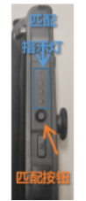
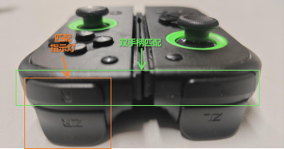

# Configuration Instructions for 2 Robot Arms + 2 Controllers (Dual-Arm Operation)

<p align="center">
  <a href="Double_tutorial_en.md">English</a> •
  <a href="Double_tutorial.md">中文</a> 
</p>
&nbsp;

## (1) Device Number Binding

### 1. Fix Device Numbers to Custom Ports (Box Recommended)

**Not recommended:** [Original port setting method](./bugs_Q&A.md#L1).  
**Reason:** By mapping device rules, you ensure that even if the robot arms are plugged in a different order, the correct port ID is always read. This avoids calibration file errors and damage to the robot arm due to incorrect left/right assignment. Configuration steps:

1. Plug in the right robot arm. **Only plug in one arm** to the USB port. Run:
  
```shell
udevadm info -a -n /dev/ttyACM* | grep serial
```

```shell
# The output will look like:
#     ATTRS{serial}=="58FA083324"
#     ATTRS{serial}=="0000:00:14.0"
```

2. Copy the above `ATTRS{serial}` value and paste it in the **first line** of [lerobot/configs/robot/rules/99-lerobot-serial.rules](lerobot/configs/robot/rules/99-lerobot-serial.rules), representing `lerobot_right` (right arm or main arm).
  
3. **Unplug** the just-plugged arm, **plug in the other** arm (ideally the left arm, or the follower), and check the ID:

```shell
udevadm info -a -n /dev/ttyACM* | grep serial # If you only have one arm, only modify the first line
```

4. Enter the output ID in the **second line** of [lerobot/configs/robot/rules/99-lerobot-serial.rules](lerobot/configs/robot/rules/99-lerobot-serial.rules), representing `lerobot_left` (left arm or follower).
  
5. Run the commands below to copy the rules file into Ubuntu’s system directory. The system will then auto-recognize left and right arms:

```shell
sudo cp lerobot/configs/robot/rules/99-lerobot-serial.rules /etc/udev/rules.d/
sudo chmod +x /etc/udev/rules.d/99-lerobot-serial.rules
sudo udevadm control --reload-rules && sudo udevadm trigger
# If a password prompt interrupts, please rerun the command. (Mouse may freeze briefly during normal execution)
```

&nbsp;

## (2) Robot Arm Calibration

### 1. Calibration Command

1. **Plug in both robot arms**. If you followed the above configuration, the mapping is:

- `Left Arm` == `lerobot_left` ⇒ Will prompt "main follower" during calibration.
- `Right Arm` == `lerobot_right` ⇒ Will prompt "main leader" during calibration.

Calibration typically starts with the follower (left arm), then right arm. (Note: Each calibration will delete previous calibration files. If aborted or errored, calibration files will not exist.)

```shell
# For dual-arm calibration
python lerobot/scripts/control_robot.py calibrate \
    --robot-path lerobot/configs/robot/so100.yaml \
    --robot-overrides '~cameras'
```

| 1. Follower Zero Position | 2. Follower Rotated Position | 3. Follower Rest Position |
|---|---|---|
|  |  |  |

**Note:** For `2 Rotated Position`, be sure to observe the arm’s direction and rotate each joint slowly to avoid motor damage.

- For “failed due to communication error”, see [bugs_Q&A.md#L27](bugs_Q&A.md#L27)

&nbsp;

## (3) Dataset Recording [Master-Follower Mode Collection Test]

### 1. Teleoperation Test without Camera Observation (Right Arm Controls Left Arm)

```shell
python lerobot/scripts/control_robot.py teleoperate \
    --robot-path lerobot/configs/robot/so100.yaml \
    --robot-overrides '~cameras' \
    --display-cameras 0
```

- For “No integer found” errors, see [bugs_Q&A.md#L38](bugs_Q&A.md#L38)

### 3. Teleoperation with Camera Visualization

```shell
python lerobot/scripts/control_robot.py teleoperate \
    --robot-path lerobot/configs/robot/so100.yaml 
```

If program freezes/no response: [bugs_Q&A.md#L53](bugs_Q&A.md#L53)  
If camera not found: [bugs_Q&A.md#L66](bugs_Q&A.md#L66)

### 4. Dataset Recording

```shell
python lerobot/scripts/control_robot.py record \
    --robot-path lerobot/configs/robot/so100.yaml \
    --fps 30 \
    --tags so100 tutorial \
    --warmup-time-s 5 \
    --episode-time-s 40 \
    --reset-time-s 5 \
    --num-episodes 10 \
    --push-to-hub 0 \
    --local-files-only 1 \
    --root datasets/so100_test \
    --repo-id task/so100_test \
    --single-task so100_test \
    --resume 1 
```

(1) Important Parameter Description:

  - `robot-path`: Path to robot configuration file
  - `root`: Save path
  - `reset-time-s`: Recording duration
  - `num-episodes`: Number of rounds to collect per session
  - `fps`: Camera frame rate

(2) Usage Instructions:
  - Script starts rolling frames and recording
  - `Right Arrow >`: Finish current task, save, and prepare to record next episode
  - `Left Arrow <`: Wait 10s and re-record current episode
  - `ESC`: Finish recording (do **not** use Ctrl+C, which will corrupt the dataset)

### 5. Dataset Visualization

You can view recorded trajectory data, including images and poses.

```shell
python lerobot/scripts/visualize_dataset.py \
    --root datasets/so100_test \
    --local-files-only 1 \
    --mode 0 \
    --repo-id task/so100_test \
    --episode-index 0 \
    --save 1 \
    --output-dir datasets/so100_test/visualize
    
rerun datasets/so100_test/visualize/task_so100_test_episode_0.rrd
```


### 6. Dataset Replay

The robot arm will repeat a previously recorded trajectory (caution: it will physically move as previously recorded).

```shell
DATA_DIR=data python lerobot/scripts/control_robot.py replay \
    --robot-path lerobot/configs/robot/so100.yaml \
    --fps 30 \
    --root datasets/so100_test \
    --repo-id task/so100_test \
    --episode 0 \
    --local-files-only 1
```

&nbsp;

## (5) Local Training and Inference

Huggingface recommends cloud hosting, but for local model training some setup is needed. [This repo is configured](bugs_Q&A.md#L98).

### 1. Start Local Training

```shell
python lerobot/scripts/train.py \
  policy=act_so100_real \
  env=so100_real \
  device=cuda \
  wandb.enable=false \
  local_only.enable=true \
  dataset_repo_id=task/so100_test \
  hydra.run.dir=outputs/train/act_so100_test \
  hydra.job.name=act_so100_test \
  local_only.path=datasets/so100_test 
```
Pay special attention to the policy config file:  
Training steps `offline_steps` and save frequency `save_freq` at [lerobot/configs/policy/act_so100_real.yaml:30](lerobot/configs/policy/act_so100_real.yaml:30)

For errors, see [bugs_Q&A.md#L133](bugs_Q&A.md#L133)

### 2. Start Inference

It’s recommended to use `record` with the `eval` tag for inference, which will also record inference data to an address prefixed with `eval_`.

```shell
python lerobot/scripts/control_robot.py record \
  --robot-path lerobot/configs/robot/so100.yaml \
  --fps 30 \
  --tags so100 tutorial eval \
  --warmup-time-s 5 \
  --episode-time-s 40 \
  --reset-time-s 5 \
  --num-episodes 10 \
  --local-files-only 1 \
  --root datasets/eval_so100_test \
  --repo-id task/eval_so100_test \
  --single-task eval_so100_test \
  -p outputs/train/act_so100_test/checkpoints/last/pretrained_model 
```
&nbsp;

## (6) JoyCon Controller Teleoperation

### 0. Environment Setup

Teleoperation via controller requires installing joycon-robotics (for driver & teleop policy) and lerobot-kinematics (for kinematics calculation).

- [joycon-robotics](https://github.com/box2ai-robotics/joycon-robotics)
- [lerobot-kinematics](https://github.com/box2ai-robotics/lerobot-kinematics)

Install as follows:

```shell
# joycon-robotics
conda activate lerobot
git clone https://github.com/box2ai-robotics/joycon-robotics.git
cd joycon-robotics

pip install -e .
sudo apt-get update
sudo apt-get install -y dkms libevdev-dev libudev-dev cmake
make install
# It's best to test with joycon-robotics/joyconrobotics_tutorial.ipynb before continuing

# lerobot-kinematics
conda activate lerobot
git clone https://github.com/box2ai-robotics/lerobot-kinematics.git
cd lerobot-kinematics
pip install -e .
```

- For network errors, see [bugs_Q&A.md#L1](bugs_Q&A.md#L1)

If you want to try kinematics control only, copy [lerobot/.cache/calibration/so100/main_follower.json](lerobot/.cache/calibration/so100/main_follower.json) to the `lerobot-kinematics/examples` directory and refer to its readme.

### 1. Bluetooth Pairing

1. For first time pairing: **Long press the small round button on the side of the controller for 3 seconds** to pair via Bluetooth. Your computer should see "Joy-Con(R)" or "Joy-Con(L)" as a device—click to pair.
 
2. Once connected, the controller will **vibrate at a certain frequency**. For single controller: hold both trigger buttons for 3 seconds. For dual controllers: after both vibrate, simultaneously press the upper trigger button (L for left, R for right). The system will then assign processes to each controller for connection monitoring.

 
 

3. After successful pairing, to reconnect, just press the upper trigger button. Within 5 seconds, you'll feel vibration again—repeat the last step to connect.

### 2. Teleoperation by Controller

#### (1) Rename Calibration Parameter Files

Rename the calibration files as follows:

- Copy and rename `main_leader.json` to `right_follower.json`
- Copy and rename `main_follower.json` to `left_follower.json`

Quick rename command (hidden folder, show with ctrl+H):

```shell
# For dual robot arms
cp .cache/calibration/so100/main_leader.json .cache/calibration/so100/right_follower.json
cp .cache/calibration/so100/main_follower.json .cache/calibration/so100/left_follower.json
```

#### (2) Single Arm Controller Teleoperation:

```shell
# remember 
# cp .cache/calibration/so100/main_follower.json .cache/calibration/so100/right_follower.json
python lerobot/scripts/control_robot.py teleoperate \
    --robot-path lerobot/configs/robot/so100_joycon_single.yaml \
    --robot-overrides '~cameras' 
```

- For controller bugs: [bugs_Q&A.md#L140](bugs_Q&A.md#L140)
- For STL file errors: [bugs_Q&A.md#L129](bugs_Q&A.md#L129)
- For GLX/OpenGL errors: [bugs_Q&A.md#L43](bugs_Q&A.md#L43)
- For program freeze: [bugs_Q&A.md#L53](bugs_Q&A.md#L53)
- For camera not found: [bugs_Q&A.md#L66](bugs_Q&A.md#L66)

#### (3) Dual Arm Controller Teleoperation:

```shell
# remember
# cp .cache/calibration/so100/main_leader.json .cache/calibration/so100/right_follower.json
# cp .cache/calibration/so100/main_follower.json .cache/calibration/so100/left_follower.json
python lerobot/scripts/control_robot.py teleoperate \
    --robot-path lerobot/configs/robot/so100_joycon_double.yaml \
    --robot-overrides '~cameras' 
```

#### (4) Tutorial:
##### Coordinate System

- End-effector front direction: `X+`
- Right side: `Y+`
- Up: `Z+`

##### Joystick Control (End-effector First Person)

- Up: move forward along end-effector direction
- Down: move backward
- Left: move left
- Right: move right

##### Button Functions

**Basic Functions**

1. **Reset:**
   - Right `Home` key or Left `O` (screenshot): Return to home position  
   

2. **Gripper Control:**
   - Right `ZR` (lower trigger) or Left `ZL` (lower trigger): Toggle gripper open/close

3. **Height Control:**
   - Press joystick vertically: Decrease `Z-axis`
   - `L`/`R` (upper trigger): Increase `Z-axis`

4. **Forward/Backward:**
   - Left Up Arrow or Right `X`: Move end-effector along `X+`
   - Left Down Arrow or Right `B`: Move end-effector along `X-`

5. **Recording Control:**
   - Right `A`: Save current data and start recording next (recommended, don't use keyboard)
   - Right `Y`: Re-record current dataset (for errors)

### 3. Controller Data Collection

Note: You need to use `so100_joycon_single.yaml` or `so100_joycon_double.yaml` for right/single or dual arm operation.

Remaining steps are similar to above. Have fun!

#### **Single Arm Example:**

```shell
# 1.0 Data Collection
python lerobot/scripts/control_robot.py record \
    --robot-path lerobot/configs/robot/so100_joycon_single.yaml \
    --fps 30 \
    --tags so100 tutorial \
    --warmup-time-s 5 \
    --episode-time-s 40 \
    --reset-time-s 5 \
    --num-episodes 20 \
    --push-to-hub 0 \
    --local-files-only 1 \
    --root datasets/pick_put \
    --repo-id task/pick \
    --single-task pick_put \
    --resume 1 
    
# 1.1 Visualize Dataset
python lerobot/scripts/visualize_dataset.py \
    --root datasets/pick_put \
    --local-files-only 1 \
    --mode 0 \
    --repo-id task/pick_put \
    --episode-index 0 \
    --save 1 \
    --output-dir datasets/pick_put/visualize
    
# 1.2 Play Dataset
rerun datasets/pick_put/visualize/task_pick_put_episode_0.rrd

# 1.3 Trajectory Replay
DATA_DIR=data python lerobot/scripts/control_robot.py replay \
    --robot-path lerobot/configs/robot/so100_joycon_single.yaml \
    --fps 30 \
    --root datasets/pick_put \
    --repo-id task/pick_put \
    --episode 0 \
    --local-files-only 1

# 2.0 Model Training
python lerobot/scripts/train.py \
  policy=act_so100_real_single \
  env=so100_real_single \
  device=cuda \
  wandb.enable=false \
  local_only.enable=true \
  dataset_repo_id=task/pick_put \
  hydra.run.dir=outputs/train/act_pick_put \
  hydra.job.name=act_pick_put \
  local_only.path=datasets/pick_put 

# 3. Model Inference
python lerobot/scripts/control_robot.py record \
  --robot-path lerobot/configs/robot/so100_joycon_single.yaml \
  --fps 30 \
  --tags so100 tutorial eval \
  --warmup-time-s 5 \
  --episode-time-s 40 \
  --reset-time-s 5 \
  --num-episodes 10 \
  --push-to-hub 0 \
  --local-files-only 1 \
  --root datasets/eval_pick_put \
  --repo-id task/eval_pick_put \
  --single-task eval_pick_put \
  -p outputs/train/act_pick_put/checkpoints/last/pretrained_model 
  
```

If you encounter the following training error:  
`dataset.meta.stats[key][stats_type] = torch.tensor(stats, dtype=torch.float32) TypeError: 'NoneType' object is not subscriptable`  
It means the dataset is corrupted. Always finish recording with ESC instead of Ctrl+C.

#### **Dual Arm Example:**

```shell
# 1.

0 Data Collection
python lerobot/scripts/control_robot.py record \
    --robot-path lerobot/configs/robot/so100_joycon_double.yaml \
    --fps 30 \
    --tags so100 tutorial \
    --warmup-time-s 5 \
    --episode-time-s 40 \
    --reset-time-s 5 \
    --num-episodes 20 \
    --push-to-hub 0 \
    --local-files-only 1 \
    --root datasets/pick_put_double \
    --repo-id task/pick \
    --single-task pick_put_double \
    --resume 1 
    
# 1.1 Visualize Dataset
python lerobot/scripts/visualize_dataset.py \
    --root datasets/pick_put_double \
    --local-files-only 1 \
    --mode 0 \
    --repo-id task/pick_put_double \
    --episode-index 0 \
    --save 1 \
    --output-dir datasets/pick_put_double/visualize
    
# 1.2 Play Dataset
rerun datasets/pick_put_double/visualize/task_pick_put_double_episode_0.rrd

# 1.3 Trajectory Replay
DATA_DIR=data python lerobot/scripts/control_robot.py replay \
    --robot-path lerobot/configs/robot/so100_joycon_double.yaml \
    --fps 30 \
    --root datasets/pick_put_double \
    --repo-id task/pick_put_double \
    --episode 0 \
    --local-files-only 1

# 2. Model Training
python lerobot/scripts/train.py \
  policy=act_so100_real_double \
  env=so100_real_double \
  device=cuda \
  wandb.enable=false \
  local_only.enable=true \
  dataset_repo_id=task/pick_put_double \
  hydra.run.dir=outputs/train/act_pick_put_double \
  hydra.job.name=act_pick_put_double \
  local_only.path=datasets/pick_put_double 

# 3. Model Inference
python lerobot/scripts/control_robot.py record \
  --robot-path lerobot/configs/robot/so100_joycon_double.yaml \
  --fps 30 \
  --tags so100 tutorial eval \
  --warmup-time-s 5 \
  --episode-time-s 40 \
  --reset-time-s 5 \
  --num-episodes 10 \
  --push-to-hub 0 \
  --local-files-only 1 \
  --root datasets/eval_pick_put_double \
  --repo-id task/eval_pick_put_double \
  --single-task eval_pick_put_double \
  -p outputs/train/act_pick_put_double/checkpoints/last/pretrained_model 
  
```

#### **Custom Tasks:**

```shell
# 1. Data Collection
python lerobot/scripts/control_robot.py record \
    --robot-path lerobot/configs/robot/so100_joycon.yaml \
    --fps 30 \
    --tags so100 tutorial \
    --warmup-time-s 5 \
    --episode-time-s 40 \
    --reset-time-s 5 \
    --num-episodes <number you want, e.g. 50> \
    --push-to-hub 0 \
    --local-files-only 1 \
    --root datasets/<your task name, e.g. pick> \
    --repo-id task/<your task name, e.g. pick> \
    --single-task <your task name, e.g. pick> \
    --resume 1

# 2. Model Training
python lerobot/scripts/train.py \
  policy=act_so100_real_double \
  env=so100_real \
  device=cuda \
  wandb.enable=false \
  local_only.enable=true \
  dataset_repo_id=task/<your task name> \
  hydra.run.dir=outputs/train/<your task name> \
  hydra.job.name=<your task name> \
  local_only.path=datasets/<your task name> 

# 3. Model Inference
python lerobot/scripts/control_robot.py record \
  --robot-path lerobot/configs/robot/so100_joycon.yaml \
  --fps 30 \
  --tags so100 tutorial eval \
  --warmup-time-s 5 \
  --episode-time-s <max seconds per dataset, e.g. 40> \
  --reset-time-s <interval between episodes, e.g. 5> \
  --num-episodes <number you want, e.g. 50> \
  --root datasets/<your task name> \
  --repo-id task/eval_<your task name> \
  --single-task eval_<your task name> \
  -p outputs/train/act_<your task name>/checkpoints/last/pretrained_model 
  
```

## (7) Advanced

If you’ve completed: **1. Robot arm configuration → 2. Data collection → 3. Model training → 4. Model inference/deployment → 5. Robot arm replicates demo trajectory**,  

Congratulations! You’re in! Take a break and appreciate the progress, despite the challenging setup (dual boot, Nvidia, pytorch, etc). Now most configs are permanent and tunable.

### 1. Next Time, Only 3 Commands Needed:

```shell
# 1. Data Collection
python lerobot/scripts/control_robot.py record \
    --robot-path lerobot/configs/robot/so100.yaml \
    --fps 30 \
    --tags so100 tutorial \
    --warmup-time-s 5 \
    --episode-time-s <max seconds per dataset, e.g. 40> \
    --reset-time-s <interval, e.g. 5> \
    --num-episodes <number you want, e.g. 50> \
    --push-to-hub 0 \
    --local-files-only 1 \
    --root datasets/<your task name> \
    --repo-id task/<your task name> \
    --single-task <your task name> \
    --resume 1
    
# 2. Model Training
python lerobot/scripts/train.py \
  policy=act_so100_real \
  env=so100_real \
  device=cuda \
  wandb.enable=false \
  local_only.enable=true \
  dataset_repo_id=task/<your task name> \
  hydra.run.dir=outputs/train/<your task name> \
  hydra.job.name=<your task name> \
  local_only.path=datasets/<your task name> 

# 3. Model Inference
python lerobot/scripts/control_robot.py record \
  --robot-path lerobot/configs/robot/so100.yaml \
  --fps 30 \
  --tags so100 tutorial eval \
  --warmup-time-s 5 \
  --episode-time-s 40 \
  --reset-time-s 5 \
  --num-episodes 10 \
  --local-files-only 1 \
  --root datasets/<your task name> \
  --repo-id task/eval_<your task name> \
  --single-task eval_<your task name> \
  -p outputs/train/act_<your task name>/checkpoints/last/pretrained_model 
  
```

### 2. Optimization Tips

If the task execution isn’t as expected:

1. Commonly Tuned Parameters:

- [offline_steps](lerobot/configs/policy/act_so100_real.yaml:30): Longer training yields more stable models.
- [vision_backbone](lerobot/configs/policy/act_so100_real.yaml:78): A stronger image encoder means a smarter visual model, e.g., resnet34.
- **Dataset:** Model performance depends greatly on data quality.

2. Dataset Optimization

- **Object visibility:** Make sure the target object is always visible to at least one camera during movement.
- **Generalization & Dataset Size:** More complex tasks require larger datasets. For each generalization factor, collect about 30 samples. E.g., for picking up a cube in a 10x10cm area and placing it randomly in a 10x10cm box, ~50 samples.
- **Random Placement:** Distribute placements evenly to avoid bias in training and validation splits.

### 3. Advanced Models

Diffusion Policy is usually considered smarter and more general than ALoha-ACT, but is harder to debug and requires more data. Recommended: at least 50 groups. Suggested parameters in [lerobot/configs/policy/diffusion.yaml](lerobot/configs/policy/diffusion.yaml):

- [n_action_steps](lerobot/configs/policy/diffusion.yaml:60): Increase inference steps to ~100 for better training.
- [observation.imag](lerobot/configs/policy/diffusion.yaml:64): Increase image input size for larger field of view, e.g., [3, 480, 640]
- [crop_shape](lerobot/configs/policy/diffusion.yaml:79): Increase random crop size, e.g., [440, 560] for 640x480 input.

Transformer-based Diffusion Policy performs better than CNN-Unet but is more sensitive to hyperparameters. To train with transformer on aloha data:

```shell
python lerobot/scripts/train.py \
  policy=diffusion_aloha \
  policy.use_transformer=true \
  env=aloha \
  env.task=AlohaTransferCube-v0 \
  device=cuda \
  wandb.enable=false \
  local_only.enable=false \
  hydra.run.dir=outputs/train/diffusion_transformer_sim_transfer \
  hydra.job.name=<your task name> \
  local_only.path=None
```

&nbsp;

## (8) More

1. For more demos and related videos, follow our [Bilibili account](https://space.bilibili.com/122291348)
2. For discussion, join our QQ group: 948755626
3. [Click here](https://item.taobao.com/item.htm?abbucket=16&detail_redpacket_pop=true&id=906794552661&ltk2=17440907659690jpsj3h7uiismft7vle37&ns=1&skuId=5933796995638) for our Taobao store, where you can purchase our finely-tuned robot arm and controller kits.

If you found this helpful, please give us a star! ⭐ ⭐ ⭐ ⭐ ⭐
