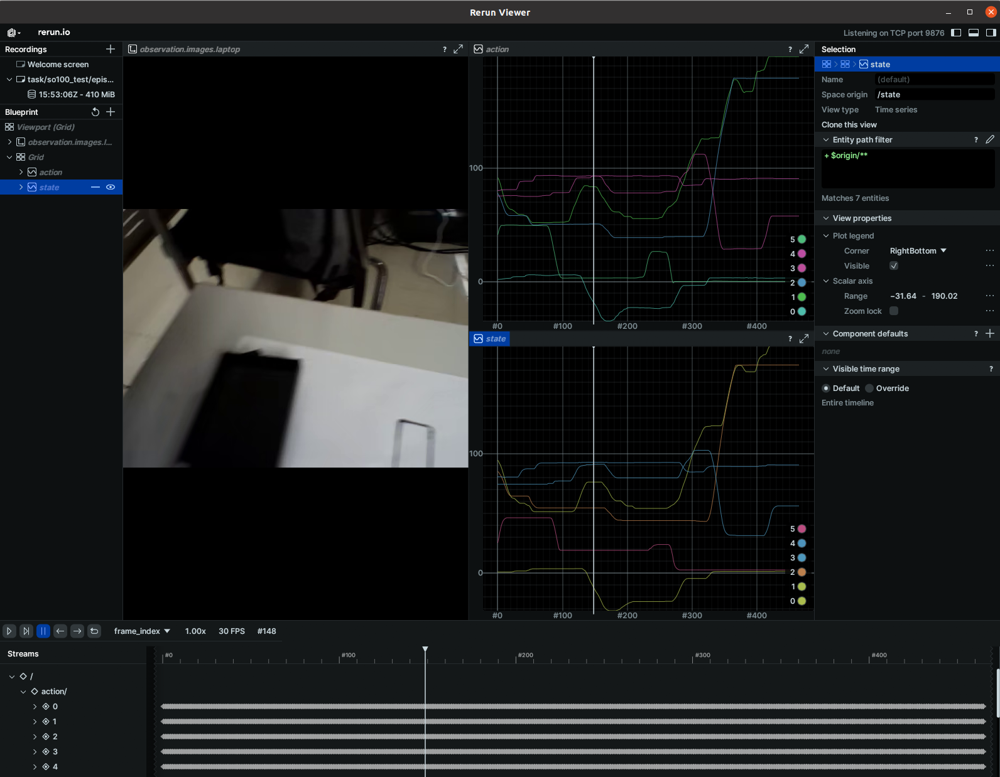

# LeRobot-JoyCon: Making AI for Robotics more accessible and Portable with JoyCon

## Declaration

This is a Lerobot branch for local acquisition deployment for the Chinese community (for some reason), and adds portable controls for Joycon as well as positive and negative kinematics controls.

This repository is a fork of the following projects,:
- [lerobot](https://github.com/huggingface/lerobot)
- [joycon-robotics](https://github.com/box2ai-robotics/joycon-robotics)
- [lerobot-kinematics](https://github.com/box2ai-robotics/lerobot-kinematics)

&nbsp;

# LeRobot-JoyCon: 利用 JoyCon 让机器人具身智能更易于使用和携带

## (〇) 声明

这是一个LeRobot的中国社区分支，除了包含完整的安装和测试指令外，还主要有以下修改：

#### 1. 基础

(1) 端口号固定映射，根据驱动板出场serial序列固定端口号映射udev的配置，无需每次插线都检查USBttyACM，生怕校准文件错乱😨。

(2) 本地化采集训练和推理，免除网络问题卡死或者登录失败的情况，相关步骤配置修改的步骤也列出了🏫。

(3) 常见的问题给出了解决方案，也欢迎将发现的问题提出，会立即补充更新❌。

(4) 优化了数据集目录检测机制，自动检测数据集是否存在，如果存在不会报错，而是接续录制⏺。

#### 2. 进阶

(1) 归纳了几点模型、数据集优化意见🔨 

(2) Diffusion Policy 参数修改优化意见🌟

(3) 适配joycon遥操做控制数据采集🎮🎮🎮。

#### 3. 更多讨论

更多讨论和交流可以加入QQ群：948755626

&nbsp;

# (一) 安装Lerobot

### 0. 系统要求

  1. Ubuntu 20.04
  2. 可连接蓝牙设备
  
### 1. 安装micromamba或者MiniConda
  
```shell
# 安装micromamba
"${SHELL}" <(curl -L micro.mamba.pm/install.sh)

# 或者安装MiniConda
# mkdir -p ~/miniconda3
# bash Miniforge3-$(uname)-$(uname -m).sh
# wget https://repo.anaconda.com/miniconda/Miniconda3-latest-Linux-x86_64.sh -O ~/miniconda3/miniconda.sh
# bash ~/miniconda3/miniconda.sh -b -u -p ~/miniconda3
# rm ~/miniconda3/miniconda.sh
# ~/miniconda3/bin/conda init bash
```

### 2. 使用conda配置lerobot环境

```shell
conda create -y -n lerobot python=3.10
conda activate lerobot
cd lerobot
pip install -e .

# 使用飞特舵机的版本
pip install -e ".[feetech]"
conda install -y -c conda-forge ffmpeg
pip uninstall -y opencv-python
conda install -y -c conda-forge "opencv>=4.10.0"

# 配置库文件链接
echo 'export LD_LIBRARY_PATH=$LD_LIBRARY_PATH:~/miniforge3/envs/lerobot/lib' >> ~/.bashrc
source ~/.bashrc
```

！！ 如果你遇到报错，请检查是否报错中存在 ``network`` ， ``timeout``等网络问题，请检查pip是否更换为国内镜像源，具体参考[pip清华源替换](https://mirrors.tuna.tsinghua.edu.cn/help/pypi/)，[Ubuntu清华源替换](https://mirrors.tuna.tsinghua.edu.cn/help/ubuntu/)

另外推荐Clash梯子为终端开启代理，这样更适合后续科研

### 3. Lerobot 目录简述

  (1) 主要的模型和配置文件在``lerobot``中，其余同级目录如docker,media等不重要
  
  (2) 主要**配置**文件夹是``lerobot/configs``，其中重点关注，``机器人(robot)``，``模型(policy)``的``lerobot/configs/robot/so100.yaml``，``/home/boxjod/lerobot/New/lerobot/lerobot/configs/policy/act_so100_real.yaml``
  
  (3) ``lerobot/scripts``中的``lerobot/scripts/control_robot.py``是控制机器人的入口python程序。
  
  (4) **模型训练和推理**的主要文件是：``训练 lerobot/scripts/train.py``， ``推理 lerobot/scripts/eval.py``
  
  (5) 其余的文件和目录入门之后可自行探索。

Note: 建议``使用Vscode打开lerobot-joycon工程目录``，打开readme.md文件之后右上角从左到右第二个图标``"打开侧边栏预览"``，可以查看更加美观的排版哦~

&nbsp;

# (二) 设备号查询

<!-- ### 1. 机械臂端口号查询

使用步骤：
  (1) 插上机械臂驱动板，
  
  (2) 打开一个终端窗口，输入如下指令
  
```shell
python lerobot/scripts/find_motors_bus_port.py
```
  (3) **拔掉**机械臂的驱动板USB，
  
  (4) 在输入指令的终端窗口敲击回车，即可检测到拔掉的是哪个端口
  
  (5) 更新到 ``lerobot/configs/robot/so100.yaml`` 中的 ``port``中，对应好主臂和从臂 -->

### 1.设备号固定为自定义端口（Box推荐）

写入设备rules，保证每次机械臂顺序插的不一样也可以读取到正确的端口ID，避免左右臂插的顺序错误导致校准文件读取错误，错误运行损坏机械臂。配置步骤如下：

  (1) 插入左边的机械臂（放置到左边自行记忆即可），这里``只能插入一根机械臂``到USB口，输入以下指令：
  
```shell
udevadm info -a -n /dev/ttyACM* | grep serial
```

```shell
# 将输出类似ID号：
#     ATTRS{serial}=="58FA083324"
#     ATTRS{serial}=="0000:00:14.0"
```
(2) 将输出的上面的编码值输入到 [99-lerobot-serial.rules](lerobot/configs/robot/rules/99-lerobot-serial.rules) 的第1行ATTRS{serial}中代表着lerobot_tty0左臂或者主臂
(3) 拔掉刚才的机械臂，插上另一个机械臂（期望是右边的，或者是从臂），查看ID


```shell
udevadm info -a -n /dev/ttyACM* | grep serial
```
  (4) 将输出的ID输入到 [99-lerobot-serial.rules](lerobot/configs/robot/rules/99-lerobot-serial.rules) 的第2行ATTRS{serial}中代表着lerobot_tty1右臂或者从臂
  (5) 将规则文件写入Ubuntu系统目录

```shell
sudo cp lerobot/configs/robot/rules/99-lerobot-serial.rules /etc/udev/rules.d/
sudo chmod +x /etc/udev/rules.d/99-lerobot-serial.rules
sudo udevadm control --reload-rules && sudo udevadm trigger
```
  (6) 更新到 ``lerobot/configs/robot/so100.yaml`` 中的，主臂的port改成``/dev/lerobot_tty0``，从臂改成``/dev/lerobot_tty1``.（这是在99-lerobot-serial.rules中设置的）

如果你觉得这对你有帮助，请您帮我们点一颗小星星吧！ ⭐ ⭐ ⭐ ⭐ ⭐

&nbsp;

# (三) 校准机械臂

### 1. 校准指令

这里``请插入两根机械臂``，如果按照上述顺序配置，对应关系如下，摆到对应位置之后，再命令终端``敲击回车``，进入下一个姿态矫正，各个姿态如下图所示。
- lerobot_tty0 == ``左臂`` ==> 校准时会提示校准 ``main follower``
- lerobot_tty1 == ``右臂`` ==> 校准时会提示校准 ``main leader``

一般会从Follower开始，即``右边机械臂开始``，然后是左边机械臂,注意每次校准会删除之前的校准文件，如果提前终止或者报错结束，将不存在校准文件

```shell
python lerobot/scripts/control_robot.py calibrate \
    --robot-path lerobot/configs/robot/so100.yaml \
    --robot-overrides '~cameras'
```

**注意``2 Rortated position``，整个机械臂姿态方向一定要观察清楚，并且转动每个关节的时候不要太快，容易烧坏电机。**

如果报错``ValueError: No integer found between bounds [low_factor=-0.00146484375, upp_factor=-0.00146484375]``,则说明校准的时候主从比刚好反了，请重新运行上面的指令重新校准，从右边的机械臂开始。
如果报错``ConnectionError: Read failed due to communication error on port /dev/lerobot_tty1 for group_key Torque_Enable_shoulder_pan_shoulder_lift_elbow_flex_wrist_flex_wrist_roll_gripper: [TxRxResult] There is no status packet!``，请重新插拔电源和USB线，如果还不行，可能是舵机线松了，请检查一下每一个电机的接线头

| 1. Follower Zero position | 2. Follower Rotated position | 3. Follower Rest position |
|---|---|---|
|  |  |  |

<!-- | 1. Leader Zero position | 2. Leader Rotated position | 3. Leader Rest position |
|---|---|---|
|  |  |  | -->

### 2. 无相机观察的遥操作测试（左臂遥控右臂）

```shell
python lerobot/scripts/control_robot.py teleoperate \
    --robot-path lerobot/configs/robot/so100.yaml \
    --robot-overrides '~cameras' \
    --display-cameras 0
```

如果出现报错ImportError: /lib/x86_64-linux-gnu/libstdc++.so.6: version `GLIBCXX_3.4.30' not found，是因为系统库地址有问题，请在终端执行下面的指令：  export LD_LIBRARY_PATH=$LD_LIBRARY_PATH:~/miniforge3/envs/lerobot/lib


!!如果你遇到报错 undefined symbol: __nvJitLinkComplete_12_4, version libnvJitLink.so.12，是因为torch版本的问题，请执行以下指令：

```shell
  python -m pip uninstall torch torchvision torchaudio
  python -m pip install --pre torch torchvision torchaudio --index-url https://download.pytorch.org/whl/nightly/cu121
```


&nbsp;
------------------------------------------------------------------------
&nbsp;
# (四) 记录数据集

### 1. 查看相机

```shell
python lerobot/common/robot_devices/cameras/opencv.py
```
输出信息中应当关注的是：

  OpenCVCamera(2, fps=10, width=640, height=480, color_mode=rgb)
  OpenCVCamera(0, fps=30, width=640, height=480, color_mode=rgb)

其中0是笔记本电脑的自带摄像头

### 2. 配置相机参数

进入``lerobot/configs/robot/so100.yaml``中修改``camera``信息，如果没有使用到手机则注释掉
```yaml
# phone:
  #   _target_: lerobot.common.robot_devices.cameras.opencv.OpenCVCamera
  #   camera_index: 1
  #   fps: 30
  #   width: 640
  #   height: 480
```

如果使用Box-Arm-V1 Camera 50Hz相机，则需要对应camera_index改为2，需要到 ``lerobot/common/robot_devices/cameras/opencv.py`` 的339行加入，如下代码选择相机的视频格式：上面的代码是：“self.camera = cv2.VideoCapture(camera_idx)”

```python
        self.camera.set(cv2.CAP_PROP_FOURCC, cv2.VideoWriter.fourcc("M", "J", "P", "G"))
        self.camera.set(cv2.CAP_PROP_FPS, 60)
```

### 3. 进行带相机图像的可视化遥操

```shell
python lerobot/scripts/control_robot.py teleoperate \
    --robot-path lerobot/configs/robot/so100.yaml 
```

!! 如果你遇到报错 undefined symbol: __nvJitLinkComplete_12_4, version libnvJitLink.so.12，是因为torch版本的问题，请执行以下指令：
```shell
  python -m pip uninstall torch torchvision torchaudio
  python -m pip install --pre torch torchvision torchaudio --index-url https://download.pytorch.org/whl/nightly/cu121
```
如果在lerobot工作空间安装了genesis会影响到torch版本，这个时候就要重新安装一下torch

### 4. 录制数据集

```shell
python lerobot/scripts/control_robot.py record \
    --robot-path lerobot/configs/robot/so100.yaml \
    --fps 30 \
    --tags so100 tutorial \
    --warmup-time-s 5 \
    --episode-time-s 40 \
    --reset-time-s 5 \
    --num-episodes 10 \
    --push-to-hub 0 \
    --local-files-only 1 \
    --root datasets/so100_test \
    --repo-id task/so100_test \
    --single-task so100_test \
    --resume 1 
   
```

(1) 重要参数说明：

  - ``robot-path``：对应的机器人参数配置文件
  - ``fps``:相机帧数
  - ``num-episodes``:本轮采集的轮数
  - ``root``:保存路径

(2) 使用说明：
  - 脚本启动轮动帧数，即开始录制
  - ``键盘右箭头 ^``：完成当前任务，保存，并准备下一次任务数据集录制
  - ``键盘上箭头 >``：等待10秒后重新录制当前剧集(episode)
  - ``键盘ESC键``: 结束录制，如果不正常Ctrl+C结束，可能会缺少数据（mean and std）

！！如果，运行之后终端卡死，从臂不跟着主臂一起动，则是因为cv没办法可视化(display)的原因
```shell
conda install -y -c conda-forge ffmpeg
pip uninstall -y opencv-python
conda install -y -c conda-forge "opencv>=4.10.0"
```

### 5. 可视化数据集
可以查看录制的轨迹数据，包括图像和轨迹姿态


```shell
python lerobot/scripts/visualize_dataset.py \
    --root datasets/so100_test \
    --local-files-only 1 \
    --mode 0 \
    --repo-id task/so100_test \
    --episode-index 0 \
    --save 1 \
    --output-dir datasets/so100_test/visualize
    
rerun datasets/so100_test/visualize/task_so100_test_episode_0.rrd
```



### 6. 重播数据集

机械臂将重复曾经录制的一个轨迹

```shell
DATA_DIR=data python lerobot/scripts/control_robot.py replay \
    --robot-path lerobot/configs/robot/so100.yaml \
    --fps 30 \
    --root datasets/so100_test \
    --repo-id task/so100_test \
    --episode 0 \
    --local-files-only 1
```

如果你觉得这对你有帮助，请您帮我们点一颗小星星吧！ ⭐ ⭐ ⭐ ⭐ ⭐

&nbsp;


# (五) 本地训练和推理

由于Huggingface建议使用它们的云托管，所以本地训练模型需要一定的设置

### 1. 修改模型配置

 1. 修改模型配置文件：[lerobot/configs/policy/act_so100_real.yaml](lerobot/configs/policy/act_so100_real.yaml)中，注释掉所有有关``phone``摄像头的段落，如下：

```yaml
    ...
    24: #  observation.images.phone:
    25: #   # stats from imagenet, since we use a pretrained vision model
    26: #   mean: [[[0.485]], [[0.456]], [[0.406]]]  # (c,1,1)
    27: #   std: [[[0.229]], [[0.224]], [[0.225]]]  # (c,1,1)
    ...
    63: # observation.images.phone: [3, 480, 640]
    ...
    71: # observation.images.phone: mean_std
    ...
```

  2. 修改数据集读取位置：在[lerobot/common/datasets/factory.py](lerobot/common/datasets/factory.py:99)的``video_backend=cfg.video_backend,``后面，加入如下代码：
  

```python
    local_files_only=cfg.local_only.enable,
    root=cfg.local_only.path,
```
  3. 增加hydra参数列表：[lerobot/configs/default.yaml](lerobot/configs/default.yaml:131)，文件末尾加入如下参数结构：


```shell
local_only:
  enable: true
  path: ???
```

### 2. 开始本地训练


```shell
python lerobot/scripts/train.py \
  policy=act_so100_real \
  env=so100_real \
  device=cuda \
  wandb.enable=false \
  local_only.enable=true \
  dataset_repo_id=task/so100_test \
  hydra.run.dir=outputs/train/act_so100_test \
  hydra.job.name=act_so100_test \
  local_only.path=datasets/so100_test 
```
其中重点关注策略模型配置：[lerobot/configs/policy/act_so100_real.yaml:30](lerobot/configs/policy/act_so100_real.yaml:30)的训练步数``offline_steps``，保存频率``save_freq``


### 3. 开始推理
推荐使用record函数中的tags为eval的模块进行推理，同时会自动记录推理的过程数据集，保存在以``eval_``开头的地址中。

```shell
python lerobot/scripts/control_robot.py record \
  --robot-path lerobot/configs/robot/so100.yaml \
  --fps 30 \
  --tags so100 tutorial eval \
  --warmup-time-s 5 \
  --episode-time-s 40 \
  --reset-time-s 5 \
  --num-episodes 10 \
  --local-files-only 1 \
  --repo-id task/eval_so100_test \
  --single-task eval_so100_test \
  -p outputs/train/act_so100_test/checkpoints/last/pretrained_model 
```
&nbsp;

# (六) 进阶

如果你按照步骤完成：``①机械臂配置 => ②数据集采集 => ③模型训练 => ④模型推理部署 => ⑤机械臂按照演示轨迹动起来``。

那么，你已经入门啦！喝口水休息一下，回顾一路上的配环境过程，你肯定经历了一路坎坷，可能还有本文没有提到的ubuntu双系统安装、Nvidia驱动安装，pytorch安装等烦人漫长的过程。但转念一想，庆幸的是你已经是深度参与全球最火热的具身智能研究的技术大佬了，接下来的过程会比较方便，因为上述配置过程都是永久性的，可参数调节的。

### 1. 下次采集数据、训练、推理只需要三条指令：

```shell
# 1.数据录制
python lerobot/scripts/control_robot.py record \
    --robot-path lerobot/configs/robot/so100.yaml \
    --fps 30 \
    --tags so100 tutorial \
    --warmup-time-s 5 \
    --episode-time-s 40 \
    --reset-time-s 你想才采集间隔等待多少秒如:5 \
    --num-episodes 你想录多少个数据如:50 \
    --push-to-hub 0 \
    --local-files-only 1 \
    --root datasets/换成你的任务的名字如:pick \
    --repo-id task/换成你的任务的名字如:pick \
    --single-task 换成你的任务的名字如:pick \
    --resume 1
    

# 2.模型训练
python lerobot/scripts/train.py \
  policy=act_so100_real \
  env=so100_real \
  device=cuda \
  wandb.enable=false \
  local_only.enable=true \
  dataset_repo_id=task/换成你的任务的名字如:pick \
  hydra.run.dir=outputs/train/换成你的任务的名字如:pick \
  hydra.job.name=换成你的任务的名字如:pick \
  local_only.path=datasets/换成你的任务的名字如:pick 

# 3. 模型推理
python lerobot/scripts/control_robot.py record \
  --robot-path lerobot/configs/robot/so100.yaml \
  --fps 30 \
  --tags so100 tutorial eval \
  --warmup-time-s 5 \
  --episode-time-s 40 \
  --reset-time-s 5 \
  --num-episodes 10 \
  --local-files-only 1 \
  --repo-id task/eval_换成你的任务的名字如:pick \
  --single-task eval_换成你的任务的名字如:pick \
  -p outputs/train/act_换成你的任务的名字如:pick/checkpoints/last/pretrained_model 
  
```

### 2. 优化小Tips

如果你觉得任务执行效果不太满足自己的预期

  1. 常调参数

- [offline_steps](lerobot/configs/policy/act_so100_real.yaml:30): 训练更长的步数，将获得更稳定的模型。

- [vision_backbone](lerobot/configs/policy/act_so100_real.yaml:78)：更强的图像编码器，也意味着更聪明的视觉模型，如resnet34

- ``数据集``：模型执行的好坏，非常大程度的决定于数据采集的好坏


  2. 数据集优化

- ``目标可视``：在机械臂运动过程中，一定要将目标物体始终可以被最少一个摄像头看到，如果没有出现在观察中即容易陷入停止或者不稳定。

- ``泛化性 & 数据集大小``：通常情况下，更复杂的任务需要更大的数据集，有几个随机泛化范围，就需要多少个30条数据，如果从一个10cm X 10cm范围内抓取一个方块放置到一个10cm X 10cm范围内随机放置的盒子中，需要50组数据。

- ``随机摆放``：推荐均匀分布摆放，避免因为训练时部分用于训练集和验证集是仅关注部分数据造成部分小数据未被训练到。

### 3. 进阶模型

Diffusion Policy通常被认为比ALoha-ACT的模型更聪明更具有泛化性，但是调试难度更大，训练不容易收敛，需要更大的数据和更多的步数，建议最少50组以上，其中[lerobot/configs/policy/diffusion.yaml](lerobot/configs/policy/diffusion.yaml)中有几个建议修改的参数：

- [n_action_steps](lerobot/configs/policy/diffusion.yaml:60): 增大任务推理步长到100左右，可以汲取ACT的部分优势，更好训练一些

- [observation.imag](lerobot/configs/policy/diffusion.yaml:64)：增大图像输入尺寸，可退有更大的视野，建议修改为[3, 480, 640]

- [crop_shape](lerobot/configs/policy/diffusion.yaml:79)：增大随机裁剪尺寸，输入图像尺寸为640x480，建议修改为[440， 560]，保留更大的视野，可以更快的收敛一些，但泛化性会相对下降

如果你觉得这对你有帮助，请您帮我们点一颗小星星吧！ ⭐ ⭐ ⭐ ⭐ ⭐

&nbsp;


# (七)JoyCon手柄遥操作

### 0. 环境配置

手柄遥操作需要用到Joycon-robotics安装手柄驱动和遥操策略，以及正逆运动学库lerobot-kinematics，进行姿态结算。

- [joycon-robotics](https://github.com/box2ai-robotics/joycon-robotics)

- [lerobot-kinematics](https://github.com/box2ai-robotics/lerobot-kinematics)

安装指令如下：

```shell
# joycon-robotics
git clone https://github.com/box2ai-robotics/joycon-robotics.git
cd joycon-robotics
pip install -e .
make install
cd ..

# lerobot-kinematics
git clone https://github.com/box2ai-robotics/lerobot-kinematics.git
cd lerobot-kinematics
pip install -e .
```

### 1. 蓝牙连接

 (1) 首次连接：长按3秒遥控器侧边小圆按钮进行蓝牙配对，在电脑中的蓝牙设备搜索中将出现“Joy-Con(R)”或者“Joy-Con(R)”点击匹配连接。
 
 (2) 连接成功之后，手柄将按照一定频率震动。如果单手柄运行，则同时按住两个扳机按钮3秒，如果是双手柄同时使用，则两只手柄都开始震动之后，同时按下左手柄的上扳机键（L）和有手柄的上扳机键（R）。此后，系统将分配固定的进程进行单手柄或双手柄的连接守护。
 
 (3) 若已连接配对成功之后，下一次连接相同的电脑只需要按下上扳机键，即可自动搜索快速匹配，5秒内机会出现一定频率的“确定震动”，按照上一步的操作即可连接成功。
 
### 2. 手柄遥操

 (1) 重命名矫正参数文件

需要将上述机械臂校准的文件重命名一下: 

``main_follower.json`` 拷贝重命名为 ``right_follower.json``;

``main_leader.json`` 拷贝重命名为 ``left_follower.json``

可以执行下面的指令快速地重命名（在"."开头隐藏文件夹中，需要按"ctrl+H"开启显示）：

```shell
cp .cache/calibration/so100/main_follower.json .cache/calibration/so100/right_follower.json
cp .cache/calibration/so100/main_leader.json .cache/calibration/so100/left_follower.json
```

(2) 单臂使用遥控器遥操作:

```shell
python lerobot/scripts/control_robot.py teleoperate \
    --robot-path lerobot/configs/robot/so100_joycon_single.yaml \
    --robot-overrides '~cameras' 
```

(3) 双臂使用遥控器遥操作:

```shell
python lerobot/scripts/control_robot.py teleoperate \
    --robot-path lerobot/configs/robot/so100_joycon_double.yaml \
    --robot-overrides '~cameras' 
    
```

如果出现报错ImportError: /lib/x86_64-linux-gnu/libstdc++.so.6: version `GLIBCXX_3.4.30' not found，是因为系统库地址有问题，请在终端执行下面的指令： 
 
```shell
export LD_LIBRARY_PATH=$LD_LIBRARY_PATH:~/miniforge3/envs/lerobot/lib
```

### 3. 手柄遥操数据集采集

注意是修改了其中的``so100.yaml``：
- ``so100_joycon_single.yaml``：即可使用右边手柄操控右边手臂
- ``so100_joycon_double.yaml``：即可使用右边手柄操控双臂采集

剩下的操作和上述遥操操作一致，祝您玩得愉快

单臂示例：

```shell
# 1.0 数据采集
python lerobot/scripts/control_robot.py record \
    --robot-path lerobot/configs/robot/so100_joycon_single.yaml \
    --fps 30 \
    --tags so100 tutorial \
    --warmup-time-s 5 \
    --episode-time-s 40 \
    --reset-time-s 5 \
    --num-episodes 20 \
    --push-to-hub 0 \
    --local-files-only 1 \
    --root datasets/pick_put \
    --repo-id task/pick \
    --single-task pick_put \
    --resume 1 
    
# 1.1 可视化数据集
python lerobot/scripts/visualize_dataset.py \
    --root datasets/pick_put \
    --local-files-only 1 \
    --mode 0 \
    --repo-id task/pick_put \
    --episode-index 0 \
    --save 1 \
    --output-dir datasets/pick_put/visualize
    
# 1.2 播放数据集
rerun datasets/pick_put/visualize/task_pick_put_episode_0.rrd

# 1.3 轨迹复现
DATA_DIR=data python lerobot/scripts/control_robot.py replay \
    --robot-path lerobot/configs/robot/so100_joycon_single.yaml \
    --fps 30 \
    --root datasets/pick_put \
    --repo-id task/pick_put \
    --episode 0 \
    --local-files-only 1


# 2.0模型训练
python lerobot/scripts/train.py \
  policy=act_so100_real_single \
  env=so100_real_single \
  device=cuda \
  wandb.enable=false \
  local_only.enable=true \
  dataset_repo_id=task/pick_put \
  hydra.run.dir=outputs/train/act_pick_put \
  hydra.job.name=act_pick_put \
  local_only.path=datasets/pick_put 

# 3. 模型推理
python lerobot/scripts/control_robot.py record \
  --robot-path lerobot/configs/robot/so100_joycon_single.yaml \
  --fps 30 \
  --tags so100 tutorial eval \
  --warmup-time-s 5 \
  --episode-time-s 40 \
  --reset-time-s 5 \
  --num-episodes 10 \
  --push-to-hub 0 \
  --local-files-only 1 \
  --root datasets/eval_pick_put \
  --repo-id task/eval_pick_put \
  --single-task eval_pick_put \
  -p outputs/train/act_pick_put/checkpoints/last/pretrained_model 
  
```


双臂示例

```shell
# 1.0 数据采集
python lerobot/scripts/control_robot.py record \
    --robot-path lerobot/configs/robot/so100_joycon_double.yaml \
    --fps 30 \
    --tags so100 tutorial \
    --warmup-time-s 5 \
    --episode-time-s 40 \
    --reset-time-s 5 \
    --num-episodes 20 \
    --push-to-hub 0 \
    --local-files-only 1 \
    --root datasets/pick_put_double \
    --repo-id task/pick \
    --single-task pick_put_double \
    --resume 1 
    
# 1.1 可视化数据集
python lerobot/scripts/visualize_dataset.py \
    --root datasets/pick_put_double \
    --local-files-only 1 \
    --mode 0 \
    --repo-id task/pick_put_double \
    --episode-index 0 \
    --save 1 \
    --output-dir datasets/pick_put_double/visualize
    
# 1.2 播放数据集
rerun datasets/pick_put_double/visualize/task_pick_put_double_episode_0.rrd

# 1.3 轨迹复现
DATA_DIR=data python lerobot/scripts/control_robot.py replay \
    --robot-path lerobot/configs/robot/so100_joycon_double.yaml \
    --fps 30 \
    --root datasets/pick_put_double \
    --repo-id task/pick_put_double \
    --episode 0 \
    --local-files-only 1


# 2.0模型训练
python lerobot/scripts/train.py \
  policy=act_so100_real_double \
  env=so100_real_double \
  device=cuda \
  wandb.enable=false \
  local_only.enable=true \
  dataset_repo_id=task/pick_put_double \
  hydra.run.dir=outputs/train/act_pick_put_double \
  hydra.job.name=act_pick_put_double \
  local_only.path=datasets/pick_put_double 

# 3. 模型推理
python lerobot/scripts/control_robot.py record \
  --robot-path lerobot/configs/robot/so100_joycon_double.yaml \
  --fps 30 \
  --tags so100 tutorial eval \
  --warmup-time-s 5 \
  --episode-time-s 40 \
  --reset-time-s 5 \
  --num-episodes 10 \
  --push-to-hub 0 \
  --local-files-only 1 \
  --root datasets/eval_pick_put_double \
  --repo-id task/eval_pick_put_double \
  --single-task eval_pick_put_double \
  -p outputs/train/act_pick_put_double/checkpoints/last/pretrained_model 
  
```

自定义

```shell
# 1.数据录制
python lerobot/scripts/control_robot.py record \
    --robot-path lerobot/configs/robot/so100_joycon.yaml \
    --fps 30 \
    --tags so100 tutorial \
    --warmup-time-s 5 \
    --episode-time-s 40 \
    --reset-time-s 5 \
    --num-episodes 你想录多少个数据如:50 \
    --push-to-hub 0 \
    --local-files-only 1 \
    --root datasets/换成你的任务的名字如:pick \
    --repo-id task/换成你的任务的名字如:pick \
    --single-task 换成你的任务的名字如:pick \
    --resume 1

# 2.模型训练
python lerobot/scripts/train.py \
  policy=act_so100_real_double \
  env=so100_real \
  device=cuda \
  wandb.enable=false \
  local_only.enable=true \
  dataset_repo_id=task/换成你的任务的名字如:pick \
  hydra.run.dir=outputs/train/换成你的任务的名字如:pick \
  hydra.job.name=换成你的任务的名字如:pick \
  local_only.path=datasets/换成你的任务的名字如:pick 

# 3. 模型推理
python lerobot/scripts/control_robot.py record \
  --robot-path lerobot/configs/robot/so100_joycon.yaml \
  --fps 30 \
  --tags so100 tutorial eval \
  --warmup-time-s 5 \
  --episode-time-s 40 \
  --reset-time-s 5 \
  --num-episodes 10 \
  --repo-id task/eval_换成你的任务的名字如:pick \
  --single-task eval_换成你的任务的名字如:pick \
  -p outputs/train/act_换成你的任务的名字如:pick/checkpoints/last/pretrained_model 
  
```
